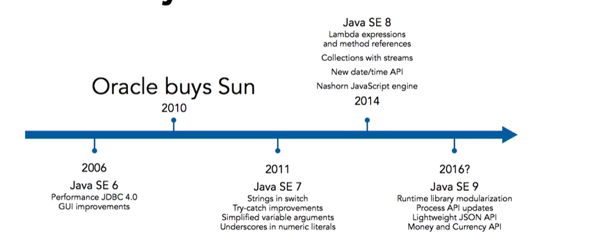
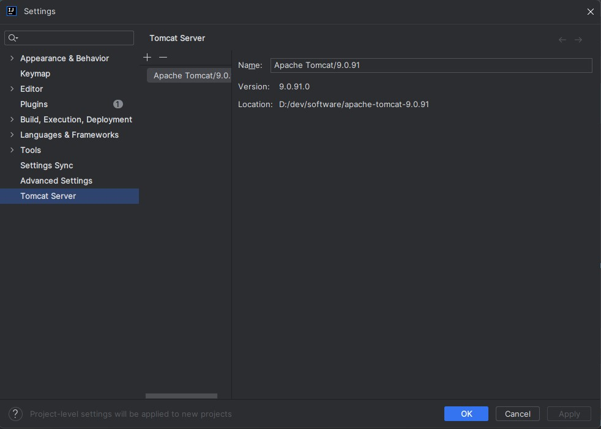
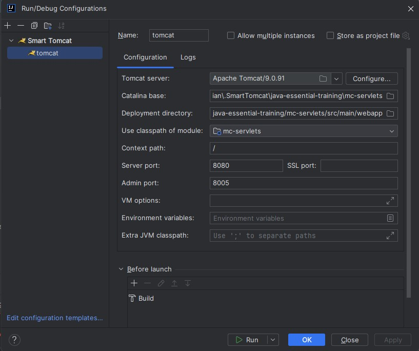

# Java Essential Training

## History

- A new portable language
- Original Name: Oak
- Tag line: Write once, Run Everywhere




## Principles

- Simple, Object-oriented, and familiar
- Robust and secure(Methods, properties and Debugging)
- Architecture-neutral and portable
- High-performance
- Interpreted, threaded(more than one processes) and dynamic

## Runtime Architecture

- It is an interpreted language.
- It compiles the bytecode instead of machine language
- The compiled application is portable between platforms without recompiling(JVM)


## Java v/s JavaScript


## Features

- Java Platform, Micro Edition(ME) (Micro-Controller, sensors and mobile devices)
- Java Runtime Environment (Java SE Runtime Environment (JRE) includes JVM),
Supported on Windows, Linux, OS X and Solaris, Runs all java applications: desktop, browser and server,
Must be updated to keep up with the security issues, Mobile operating systems have their own runtimes.
- Java development kit(JDK): It is a no cost from ORACLE, Include tools for the compilation and packaging<br>
  - java: runtime
  - javac: compile
  - javadoc: docs builder
  - jar: archive builder

## Creating classes

- All codes are defined in classes
- Classes are defined in the src code files with .java extensions
- javac command compiles Java code into byte code

## Identifier Conventions

- Classes start with the uppercase character, class MyClass{}
- Methods and variables start with the lowercase character.<br>

```java
    void doSomething() {
    }
```
- Constants are always UpperCase

```java

    public static final String FIRST_NAME = "david";

```

## Memory management and Garbage collection

- Automatic Memory Management (Memory for objects is allocated automatically)
- Objects are created in the heap memory
- As long as any variable references an object, its's retained
- When all the references expire, then it is available for the garbage collection

## Reference Expire?

- Variables local to methods or code blocks expire with scope,<br>

```java

    void checkString() {
        String localVar = "Test String";
        System.out.println("Tes" + localVar);
    }
    
```

- We can defer variable with the null keyword,

```java

String tempVar = "Test string";
tempVar = null;

```

## Servlets

- Install the tomcat version: https://tomcat.apache.org/download-90.cgi
- After installing the server import it in the intelliJ smart tomcat runner plugin: `D:\dev\software\apache-tomcat-9.0.91`,

  - Setting up the tomcat path
      
  
  - Setting up the tomcat runner details
       


## Design Patterns

For every software architectural processes the design principles plays crucial role in development, [Design patterns](/docs/java-design-pattern.md)


